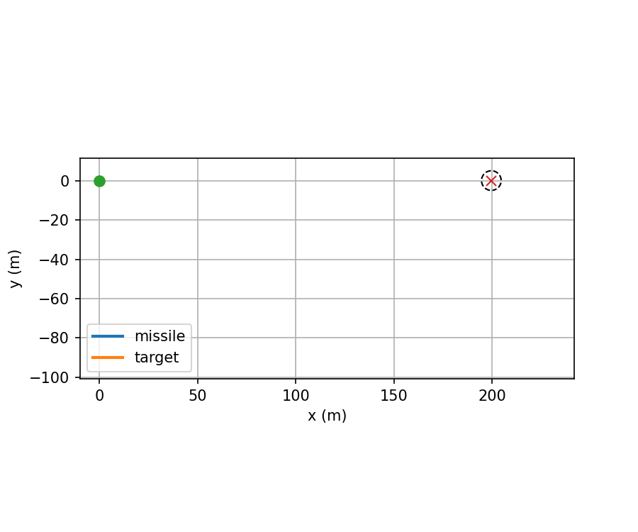

# **interceptDynamics-Py**  

**2D pursuit-evasion interception with constrained MPC (QP) vs classical PD guidance**

A clean, reproducible **planar interception simulator** built to study **non-RL optimal control** for pursuit-evasion problems.  
The project compares a **classical PD baseline** against a **constraint-aware MPC (QP)** controller under increasingly stressed target maneuvers, with full metrics, plots, and portable animations.

This repo is intentionally **engineering-first**: transparent assumptions, interpretable controllers, and deterministic results.

---

## What this project does

- Models a **2D point-mass missile-target interception problem**
- Implements a **classical PD guidance baseline**
- Implements a **constrained MPC controller (QP, CVXPY/OSQP)**
- Enforces:
  - acceleration bounds
  - slew-rate bounds
- Evaluates controllers on **straight, turning, and stressed turning targets**
- Produces:
  - trajectory plots
  - distance-to-target plots
  - control activity plots
  - quantitative metrics
  - **GIF animations** (no FFmpeg dependency)

---

## Repository structure

```text
interceptDynamics-Py/
│
├─ src/
│  ├─ dynamics.py
│  ├─ scenarios.py
│  ├─ sim.py
│  ├─ controllers/
│  │  ├─ baseline.py
│  │  └─ mpc_qp.py
│  ├─ metrics.py
│  ├─ plotting.py
│  └─ animation.py
│
├─ scripts/
│  └─ run_all.py
│
├─ notebooks/
│  ├─ interceptDynamics-experiment.zip
│  └─ interceptDynamics-experiment.pdf
│
├─ results/
│  ├─ plots/
│  ├─ animations/
│  └─ logs/
│
└─ README.md
```

## Quickstart

### 1) Install dependencies
```bash
pip install -r requirements.txt
```

### 2) Run the full experiment
```bash
python scripts/run_all.py
```

All outputs are saved automatically to `results/`.

---

## Mathematical Modeling

This project studies a **planar 2D pursuit-evasion interception problem** using a minimal but control-faithful point-mass model. Both the missile and the target are modeled as second-order particles in an inertial plane, while guidance and control are formulated in **relative coordinates** for direct interception reasoning.

The modeling framework consists of:

1. inertial-frame point-mass dynamics for the missile and target,
2. a relative-state formulation for guidance,
3. discrete-time propagation for simulation and control,
4. a geometric capture condition, and
5. actuator and slew-rate constraints for physically meaningful control.

### 1) Inertial-Frame States, Input, and Assumptions

The model uses a 2D inertial frame with the following quantities:

- Missile position: $p_m \in \mathbb{R}^2$
- Missile velocity: $v_m \in \mathbb{R}^2$
- Target position: $p_t \in \mathbb{R}^2$
- Target velocity: $v_t \in \mathbb{R}^2$

The missile control input is its commanded planar acceleration:

$$
u \in \mathbb{R}^2
$$

The target acceleration is scenario-defined:

$$
a_t(t) \in \mathbb{R}^2
$$

This keeps the problem intentionally minimal:

- both agents are treated as **point masses**,
- motion is purely **2D planar**,
- no aerodynamics, attitude, seeker, or propulsion dynamics are modeled,
- target maneuvering is injected through the scenario acceleration law.

### 2) Continuous-Time Point-Mass Dynamics

The missile and target follow second-order kinematics.

#### Missile dynamics

$$
\dot{p}_m = v_m
$$

$$
\dot{v}_m = u
$$

#### Target dynamics

$$
\dot{p}_t = v_t
$$

$$
\dot{v}_t = a_t(t)
$$

These equations are exactly what the simulator implements:

- position is the integral of velocity,
- velocity is the integral of acceleration,
- the missile acceleration is the control input,
- the target acceleration is externally specified by the scenario.

### 3) Relative-State Formulation

For guidance and interception, the problem is written in **relative coordinates**.

The relative position and relative velocity are defined as:

$$
r = p_t - p_m
$$

$$
v_{\mathrm{rel}} = v_t - v_m
$$

The relative state vector is:

$$
x =
\begin{bmatrix}
r_x \\
r_y \\
v_x \\
v_y
\end{bmatrix}
=
\begin{bmatrix}
p_{t,x} - p_{m,x} \\
p_{t,y} - p_{m,y} \\
v_{t,x} - v_{m,x} \\
v_{t,y} - v_{m,y}
\end{bmatrix}
$$

This is the state used throughout the guidance and diagnostics pipeline. It exposes the interception geometry directly: if the relative position goes to zero, the missile reaches the target.

### 4) Continuous-Time Relative Dynamics

Starting from the inertial dynamics,

$$
r = p_t - p_m
\quad \Rightarrow \quad
\dot{r} = \dot{p}_t - \dot{p}_m = v_t - v_m = v_{\mathrm{rel}}
$$

and similarly,

$$
\dot{v}_{\mathrm{rel}} = \dot{v}_t - \dot{v}_m = a_t(t) - u
$$

Therefore, the relative dynamics are:

$$
\dot{r} = v_{\mathrm{rel}}
$$

$$
\dot{v}_{\mathrm{rel}} = a_t(t) - u
$$

or, component-wise,

$$
\dot{r}_x = v_x, \qquad \dot{r}_y = v_y
$$

$$
\dot{v}_x = a_{t,x}(t) - u_x, \qquad
\dot{v}_y = a_{t,y}(t) - u_y
$$

This is the core modeling equation of the project. The controller’s job is to drive the relative position toward zero while managing relative velocity under realistic control limits.


### 5) Continuous-Time State-Space Form

Using the relative state

$$
x =
\begin{bmatrix}
r_x \\
r_y \\
v_x \\
v_y
\end{bmatrix},
\qquad
u =
\begin{bmatrix}
u_x \\
u_y
\end{bmatrix},
\qquad
a_t =
\begin{bmatrix}
a_{t,x} \\
a_{t,y}
\end{bmatrix},
$$

the dynamics can be written as

$$
\dot{x} = A_c x + B_c u + E_c a_t
$$

with

$$
A_c =
\begin{bmatrix}
0 & 0 & 1 & 0 \\
0 & 0 & 0 & 1 \\
0 & 0 & 0 & 0 \\
0 & 0 & 0 & 0
\end{bmatrix}
$$

$$
B_c =
\begin{bmatrix}
0 & 0 \\
0 & 0 \\
-1 & 0 \\
0 & -1
\end{bmatrix}
$$

$$
E_c =
\begin{bmatrix}
0 & 0 \\
0 & 0 \\
1 & 0 \\
0 & 1
\end{bmatrix}
$$

Interpretation:

- **$A_c$** propagates the kinematic relationship between relative position and relative velocity,
- **$B_c$** shows that missile acceleration affects relative acceleration with a negative sign,
- **$E_c$** injects target acceleration as an external scenario term.

This linear structure is what makes the MPC formulation clean and QP-friendly.

### 6) Discrete-Time Formulation

The project uses a discrete simulation timestep of

$$
dt = 0.05 \text{ s}
$$

with a maximum episode duration of

$$
t_{\max} = 25.0 \text{ s}
$$

The prediction model is written generically as

$$
x_{k+1} = A x_k + B u_k + d_k
$$

where:

- $x_k$ is the relative state at time step $k$,
- $u_k$ is the missile acceleration command,
- $d_k$ captures the effect of target acceleration over the step.

At the modeling level, this disturbance term comes from target maneuvering:

$$
d_k \sim a_t(k\ dt)
$$

The notebook discusses Euler-style discrete-time reasoning for controller formulation, while the actual simulator propagates the continuous-time point-mass dynamics numerically. In the implemented simulator, both missile and target are stepped using **RK4 by default** for cleaner and more stable propagation.

### 7) Numerical Integration in Simulation

For either agent, the state is packaged as

$$
s =
\begin{bmatrix}
p_x \\
p_y \\
v_x \\
v_y
\end{bmatrix}
$$

with continuous dynamics

$$
\dot{s} =
\begin{bmatrix}
v_x \\
v_y \\
a_x \\
a_y
\end{bmatrix}
$$

The simulator implements both:

- Forward Euler
- RK4

but uses **RK4** as the default integration method. This means trajectories are generated by numerical integration of the continuous-time equations under piecewise-constant acceleration commands over each timestep.

### 8) Capture / Interception Condition

Interception is defined geometrically using a capture radius:

$$
\|r_k\| = \|p_t - p_m\| \le R_{\mathrm{capture}}
$$

The project uses

$$
R_{\mathrm{capture}} = 5.0 \text{ m}
$$

So the missile is considered to have intercepted the target when the Euclidean distance between the two agents falls below 5 meters.

This is a **proximity-based capture model**, not a fuse or blast model. The repository explicitly does not include:

- terminal explosion logic,
- fuse timing,
- damage modeling,
- post-impact dynamics.

That is why repeated threshold crossings or visually coincident trajectories near capture are treated as modeling artifacts of point-mass motion plus discrete-time detection, not controller failure.

### 9) Scenario Modeling

The missile dynamics remain fixed across experiments. What changes from scenario to scenario is the target acceleration law $a_t(t)$.

The notebook explicitly defines scenario families such as:

- **straight target**: zero target acceleration,
- **turning target**: acceleration applied perpendicular to target velocity,
- more aggressive turning/stressed cases formed by increasing target maneuver intensity and/or tightening missile limits.

A turning target is created by taking the target velocity direction, normalizing it, and rotating it by $90^\circ$ to obtain a perpendicular unit vector. If $\hat{v}$ is the target velocity direction, then the target acceleration is modeled as

$$
a_t = a_{\mathrm{lat}} \, \hat{v}_{\perp}
$$

This creates continuous lateral maneuvering without changing the underlying point-mass equations.

### 10) Physical Control Constraints

To keep the problem physically meaningful, the missile acceleration command is constrained.

The project uses per-axis box bounds:

$$
|u_x| \le a_{\max}, \qquad |u_y| \le a_{\max}
$$

with

$$
a_{\max} = 30.0 \text{ m/s}^2
$$

In addition, control smoothness is limited through a per-axis slew-rate bound:

$$
|u_k - u_{k-1}| \le du_{\max}
$$

applied component-wise, with

$$
du_{\max} = 10.0 \text{ m/s}^2 \text{ per step}
$$

These limits are important because they create a meaningful difference between:

- a purely reactive classical baseline, and
- a predictive constrained optimal controller.

### 11) Baseline Guidance Model

The classical reference controller is a PD law written directly on the relative state:

$$
u_{\mathrm{raw}} = k_p r + k_d v_{\mathrm{rel}}
$$

The notebook configuration uses

$$
k_p = 0.8, \qquad k_d = 1.6
$$

This raw command is then passed through:

1. **slew-rate limiting**, and
2. **box acceleration saturation**

before being applied to the missile model.

So the baseline is not an unconstrained textbook PD law. It is a clipped, physically limited PD guidance law acting on the same relative-state model used everywhere else in the project.

### 12) MPC Prediction Model

The constrained MPC controller uses the same relative-state model, but optimizes control over a finite horizon rather than reacting myopically.

The notebook configuration uses

$$
N_{\mathrm{mpc}} = 25
$$

which, with $dt = 0.05$ s, corresponds to a prediction horizon of

$$
N_{\mathrm{mpc}} dt = 1.25 \text{ s}
$$

The optimization objective penalizes four quantities over the prediction horizon:

- relative position error,
- relative velocity error,
- control effort,
- control smoothness.

Using the project’s notation, the cost is formed from

$$
\sum_{i=0}^{N-1} w_r \|r_i\|^2
$$

$$
\sum_{i=0}^{N-1} w_v \|v_{\mathrm{rel},i}\|^2
$$

$$
\sum_{i=0}^{N-1} w_u \|u_i\|^2
$$

$$
\sum_{i=0}^{N-1} w_{\Delta u} \|u_i - u_{i-1}\|^2
$$

with config weights

$$
w_r = 10.0, \qquad
w_v = 1.0, \qquad
w_u = 0.05, \qquad
w_{\Delta u} = 0.5
$$

subject to the prediction dynamics

$$
x_{i+1} = A x_i + B u_i + d_i
$$

and the actuator and slew-rate constraints.

Only the first optimized control action is applied at each step, and the optimization is solved again at the next timestep in receding-horizon fashion.

### 13) Why This Model Fits the Project

This modeling choice is deliberately minimal, but exactly right for the project goal.

It provides:

- clean interception geometry through relative coordinates,
- deterministic and interpretable dynamics,
- a linear prediction model suitable for QP-based MPC,
- a fair comparison between a classical PD baseline and constrained optimal control.

At the same time, it stays honest about what is **not** modeled:

- no attitude dynamics,
- no seeker or sensor noise,
- no missile aerodynamics,
- no terminal blast model,
- no state estimation problem,
- no 3D engagement geometry.

So the repository presents itself correctly as an **engineering-first optimal-control interception study**, not a full missile-flight simulation.

### 14) Modeling Summary

In compact form, the project uses:

#### Inertial dynamics

$$
\dot{p}_m = v_m, \qquad \dot{v}_m = u
$$

$$
\dot{p}_t = v_t, \qquad \dot{v}_t = a_t(t)
$$

#### Relative dynamics

$$
r = p_t - p_m, \qquad v_{\mathrm{rel}} = v_t - v_m
$$

$$
\dot{r} = v_{\mathrm{rel}}, \qquad \dot{v}_{\mathrm{rel}} = a_t(t) - u
$$

#### Capture condition

$$
\|r\| \le R_{\mathrm{capture}}
$$

#### Control constraints

$$
|u_x|, |u_y| \le a_{\max}, \qquad
|u_k - u_{k-1}| \le du_{\max}
$$

This mathematical model is the backbone of the repository’s simulation, controller comparison, metrics, plots, and trajectory animations.

---

## Controllers

### PD baseline

A classical proportional-derivative controller on the relative state:

$$
u_k = K_p r_k + K_d v_{rel,k}
$$

followed by actuator saturation and slew-rate limiting.  
This controller is reactive, interpretable, and serves as a reference baseline.

### **MPC (QP)**

At each timestep, the controller solves a finite-horizon quadratic program.

**Objective**

**Position error term**

$$P_{error} = \sum_{i=0}^{N-1} w_r \|r_i\|^2$$

**Relative velocity error term**

$$R_{vel} = \sum_{i=0}^{N-1} w_v \|v_{rel,i}\|^2$$

**Control effort term**

$$C_{effort} = \sum_{i=0}^{N-1} w_u \|u_i\|^2$$

**Control smoothness (slew) term**

$$C_{smoothness} = \sum_{i=0}^{N-1} w_{\Delta u} \|u_i - u_{i-1}\|^2$$

**Final Objective**

$$finalObjective = \min_{\{u_i\}} \ (P_{error} + R_{vel} + C_{effort} + C_{smoothness})$$

**Subject to**

$$
x_{i+1} = A x_i + B u_i + d_i
$$

$$
\|u_i\|_\infty \le a_{\max},
\qquad
\|u_i - u_{i-1}\|_\infty \le du_{\max}
$$

Only the first control input $u_0^*$ is applied before re-solving at the next timestep (receding-horizon control).

---

## Results summary (stressed turning target)



- Both controllers successfully intercept the target.
- **MPC achieves interception significantly earlier**.
- MPC trades higher control saturation and energy for speed.
- PD baseline is smoother but slower and more reactive.

Metrics, plots, and logs are saved in `results/` for full transparency.

## About the **multiple touches** & **trajectory coincide** near interception

In some runs, the distance-to-target curve may cross the capture threshold more than once before the trajectories visually converge.

This is expected because:
- point-mass modeling.
- discrete-time simulation.
- proximity-based capture.
- no terminal kill modeling.

This behavior reflects a modeling boundary, not a guidance failure.

## Reproducibility

- All parameters are centralized in a config block.
- Deterministic seeds are used where applicable.
- Logs, metrics, and configs are saved alongside plots.
- A cold `Run All` reproduces the same results.

## Known limitations (by design)

- 2D kinematics only
- Scenario-defined target acceleration (perfect information).
- No sensor noise or state estimation.
- No terminal kill / blast modeling.
- Discrete capture detection.

---

## Acknowledgements

AI-based development tools were used to assist with debugging and documentation drafting.

---

# Author
### **Ayushman M.**

>LinkedIn: https://www.linkedin.com/in/aymisxx

>GitHub: https://github.com/aymisxx

---
